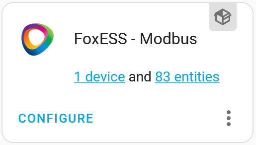
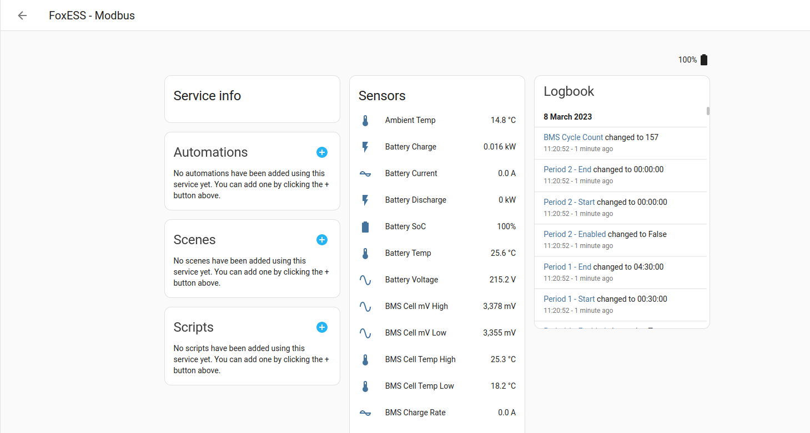
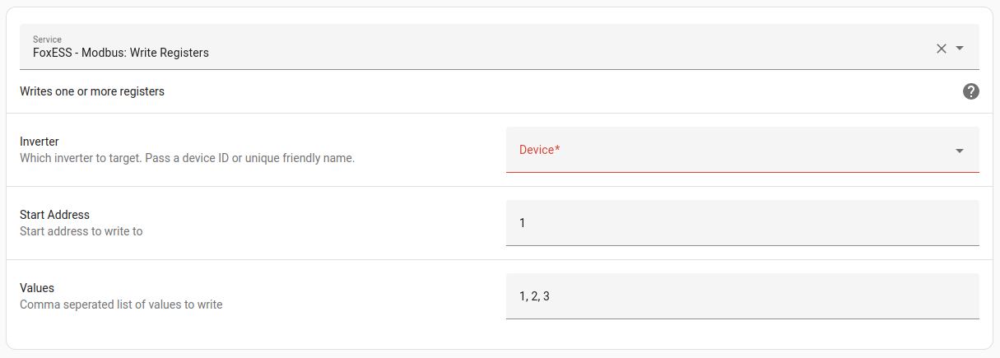
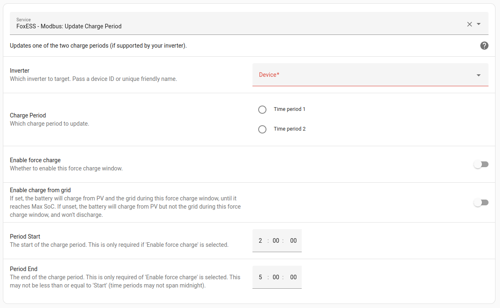

# FoxESS - Modbus

[![GitHub Release][releases-shield]][releases]
[![GitHub Activity][commits-shield]][commits]
[![License][license-shield]](LICENSE)

[![pre-commit][pre-commit-shield]][pre-commit]
[![Black][black-shield]][black]

[![hacs][hacsbadge]][hacs]
[![Project Maintenance][maintenance-shield]][user_profile]
[![BuyMeCoffee][buymecoffeebadge]][buymecoffee]

[![Discord][discord-shield]][discord]
[![Community Forum][forum-shield]][forum]

\*\* **This project is not endorsed by, directly affiliated with, maintained, authorized, or sponsored by FoxESS** \*\*

## Introduction

A Home Assistant custom component designed to ease integrating modbus data from Fox H1 inverters.

Features include:

- Autodetect inverter connection type (i.e. W610 / Direct LAN)
- Read registers in bulk to improve Home Assistant performance
- Direct decoding of values (i.e. force charge periods)

Supported models:

- H1 TCP / USB

## Installation

<details>
   <summary><b>Migrating from the StealthChestnut version?</b></summary></p>

NOTE: When transferring away from the StealthChestnut HA-FoxESS-Modbus version, before installing this integration please remove the modbus: include from the configuration.yaml, it will look similar to this (depending on the path you chose)

`modbus: !include custom_components/foxmodbuslan/modbusUSB.yaml`

AND if you have added the custom sensors (example listed below), remove them from your configuration.yaml as they are now provided from within the integration.

```
  - name: "Battery Discharge"
    device_class: "power"
    unit_of_measurement: "kW"
    state: >
       
       {{ states('sensor.battery_discharge_power') | float(default=0) * 1 }}
       
       0
       
```

Save the configuration.yaml, Check Configuration is OK and Restart Home Assistant

Now install the FoxESS modbus integration via HACS

</details>

---

Recommend installation through [HACS][hacs]

1. Navigate to HACS integrations
2. Hit the menu button (top right) and select 'Custom repositories'
3. Paste this GitHub [link][foxess_modbus] and select 'Integration'
4. Install as usual through HACS
   - 'Explore & Download Repositories'
   - Search for 'FoxESS - Modbus'
   - Download
5. Restart Home Assistant
6. Go to Settings > Devices and Services > Add Integration
7. Search for and select 'FoxESS - Modbus' (If the integration is not found, empty your browser cache and reload the page)
8. Proceed with the configuration

## Configuration and Options

<b>Select connection type</b></p>

- **TCP**: TCP connection (i.e. W610/LAN)
- **Serial**: USB connection


<b>Serial Inverter Setup</b></p>

- **Modbus Host**: Path to your USB host (default /dev/ttyUSB0)
- **Modbus Slave**: Slave ID (default 247)
- **Add another device**: Add more than one inverter


<b>TCP Inverter Setup</b></p>

- **Modbus Host**: IP Adddress of your Modbus (i.e. W610/LAN) host
- **Modbus Port**: Port number (default 502)
- **Modbus Slave**: Slave ID (default 247)
- **Add another device**: Add more than one inverter


## Usage

<b>Modbus Service</b></p>

1. Navigate to Settings -> Devices & Services to find...



2. Select '1 service' to find all Modbus readings...



<b>Write Service</b></p>

A service to write any modbus address is available, similar to the native Home Assistant service.



<b>Update Charge Periods</b></p>

Updates one of the two charge periods (if supported by your inverter).



<b>Update All Charge Periods</b></p>

Sets all charge periods in one service call. The service "Update Charge Period" is easier for end-users to use.


---

[black]: https://github.com/psf/black
[black-shield]: https://img.shields.io/badge/code%20style-black-000000.svg?style=for-the-badge
[buymecoffee]: https://www.buymeacoffee.com/nathanmarlor
[buymecoffeebadge]: https://img.shields.io/badge/buy%20me%20a%20coffee-donate-yellow.svg?style=for-the-badge
[commits-shield]: https://img.shields.io/github/commit-activity/y/nathanmarlor/foxess_modbus.svg?style=for-the-badge
[commits]: https://github.com/nathanmarlor/foxess_modbus/commits/main
[hacs]: https://hacs.xyz
[hacsbadge]: https://img.shields.io/badge/HACS-Custom-orange.svg?style=for-the-badge
[discord]: https://discord.gg/Qa5fW2R
[discord-shield]: https://img.shields.io/discord/330944238910963714.svg?style=for-the-badge
[foxessimg]: https://github.com/home-assistant/brands/raw/master/custom_integrations/foxess/logo.png
[foxess_modbus]: https://github.com/nathanmarlor/foxess_modbus
[forum-shield]: https://img.shields.io/badge/community-forum-brightgreen.svg?style=for-the-badge
[forum]: https://community.home-assistant.io/
[license-shield]: https://img.shields.io/github/license/nathanmarlor/foxess_modbus.svg?style=for-the-badge
[maintenance-shield]: https://img.shields.io/badge/maintainer-%40nathanmarlor-blue.svg?style=for-the-badge
[pre-commit]: https://github.com/pre-commit/pre-commit
[pre-commit-shield]: https://img.shields.io/badge/pre--commit-enabled-brightgreen?style=for-the-badge
[releases-shield]: https://img.shields.io/github/release/nathanmarlor/foxess_modbus.svg?style=for-the-badge
[releases]: https://github.com/nathanmarlor/foxess_modbus/releases
[user_profile]: https://github.com/nathanmarlor
[ha_modbus]: https://github.com/StealthChesnut/HA-FoxESS-Modbus
[ha_solcast]: https://github.com/oziee/ha-solcast-solar
